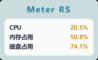
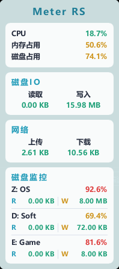
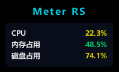
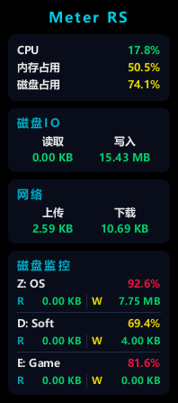

# Meter RS

一个用 Rust + Slint 写的 Windows 桌面监控小工具。

它常驻桌面右下角，显示常用系统信息，支持右键菜单、托盘菜单、磁盘监控、自启动、鼠标穿透、阻止休眠、关闭显示器、重启资源管理器、内存清理。


## 界面


<p align="center">
  
  
  
  
</p>

## 特点

- 无其他运行时依赖
- 无需安装服务
- 无需联网
- 无显卡也可以运行
- 默认支持托盘
- 单文件运行

## 功能：

- 主题切换
- 显示项开关
- 磁盘监控选择
- 窗口置顶
- 贴边吸附
- 窗口透明度
- 开机自启
- 鼠标穿透
- 阻止休眠
- 关闭显示器
- 重启资源管理器
- 清理内存
- 修改 MAC 地址
- 修改 Route
- 端口转发

## 运行

直接运行：

```bash
cargo run
```

## 构建

```bash
cargo build-win
```

如果你已经编译好了可执行文件，直接双击 `meter-rs.exe` 就行。

## 环境变量

### `SLINT_BACKEND`

这个项目只实际用到两种方式：

- `winit-femtovg`
- `winit-software`

默认情况下，不需要设置 `SLINT_BACKEND`。程序会先走 `winit-femtovg`。

如果 `winit-femtovg` 启动失败，程序会自动重新拉起自己，并切换到：`winit-software`


也可以手动指定 `SLINT_BACKEND`：

```bash
SLINT_BACKEND=winit-femtovg cargo run

SLINT_BACKEND=winit-software cargo run
```

`winit-software` 使用软件渲染，不依赖显卡。没有 GPU，或者显卡驱动有问题时，也可以运行。

### `RUST_LOG`

用来控制日志等级。

支持这些值：

- `trace`
- `debug`
- `info`
- `warn`
- `error`

默认规则：

- 开发模式默认 `trace`
- Release 默认 `error`

示例：

```bash
RUST_LOG=trace cargo run
```


日志会同时输出到控制台和 `meter-rs.log`。
